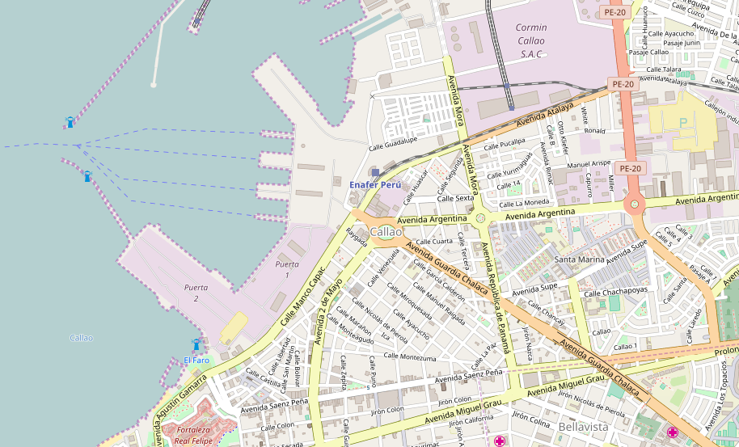
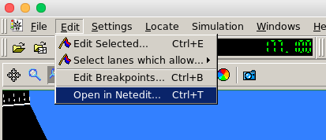
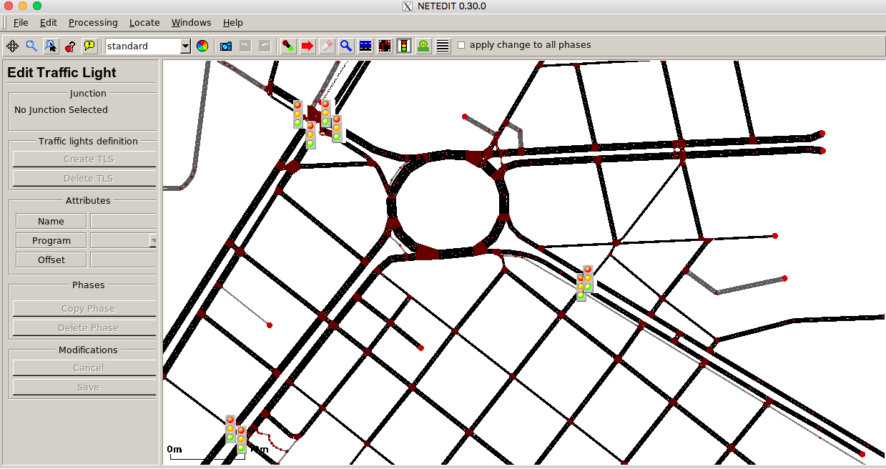
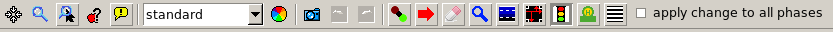
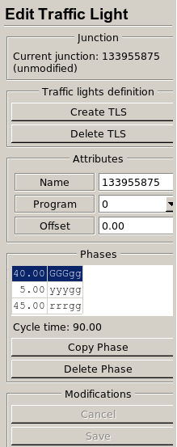
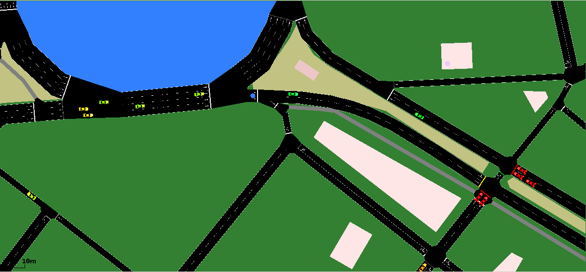

# Guia en español del programa SUMO
Este es un repositorio tutorial de cómo usar el programa de simulación del tránsito "SUMO" para representar cualquier mapa desde cualquier sistema unix, en este caso se usó como ejemplo el mapa del puerto del Callao ubicado en el Perú.

Paso 1: Descargar data de OpenStreetMap y guardarlo como "<nombre_archivo>.osm"



Paso 2: Correr este código en la terminal, en la carpeta de trabajo.

```
netconvert --osm-files <nombre_archivo>.osm -o <nombre_archivo>.net.xml
```

Esto permitirá obtener el archivo ".net" requerido para la simulación. (Netconvert importa redes de caminos o pistas digitales de diferentes fuentes y genera las redes de las autovías que se pueden usar por otras herramientas de este paquete)

Paso 3: Agregar los "polygons" estas son las características del mapa en general (areas verdes, edificios, etc)

```
polyconvert --net-file <nombre_archivo>.net.xml --osm-files <nombre_archivo>.osm --type-file typemap.xml -o <nombre_archivo>.poly.xml
```

para que sean mostradas en la interfaz gráfica de sumo.

Paso 5: Crear un archivo llamado typemap.xml con las siguientes líneas de código:

```
<polygonTypes>
  <polygonType id="waterway" name="water" color=".71,.82,.82" layer="-10"/>
  <polygonType id="natural.water" name="water" color=".71,.82,.82" layer="-10"/>
  <polygonType id="natural.wetland" name="water" color=".71,.82,.82" layer="-10"/>
  <polygonType id="sport" name="sport" color=".31,.90,.49" layer="2"/>
  <polygonType id="landuse.forest" name="forest" color="0.55,.77,.42" layer="-11"/>
  <polygonType id="natural.wood" name="forest" color="0.55,.77,.42" layer="-11"/>
  <polygonType id="natural" name="natural" color="0.55,.77,.42" layer="2"/>
  <polygonType id="landuse.park" name="park" color=".81,.96,.79" layer="-11"/>
  <polygonType id="leisure" name="leisure" color=".81,.96,.79" layer="0"/>
  <polygonType id="leisure.park" name="tourism" color=".81,.96,.79" layer="-10"/>
  <polygonType id="tourism" name="tourism" color=".81,.96,.79" layer="2"/>
  <polygonType id="landuse" name="landuse" color=".76,.76,.51" layer="-4"/>
  <polygonType id="landuse.residential" name="residential" color=".92,.92,.89" layer="-11"/>
  <polygonType id="landuse.commercial" name="commercial" color=".82,.82,.80" layer="-11"/>
  <polygonType id="shop" name="shop" color=".93,.78,1.0" layer="2"/>
  <polygonType id="landuse.industrial" name="industrial" color=".82,.82,.80" layer="-11"/>
  <polygonType id="man_made" name="building" color="1.0,.90,.90" layer="2"/>
  <polygonType id="building" name="building" color="1.0,.90,.90" layer="2"/>
  <polygonType id="amenity" name="amenity" color=".93,.78,.78" layer="2"/>
  <polygonType id="amenity.parking" name="parking" color=".72,.72,.70" layer="-2"/>
  <polygonType id="military" name="military" color=".60,.60,.36" layer="-10"/>
  <polygonType id="landuse.military" name="military" color=".60,.60,.36" layer="-10"/>
  <polygonType id="landuse.farm" name="farm" color=".95,.95,.8" layer="-11"/>
  <polygonType id="landuse.greenfield" name="farm" color=".95,.95,.8" layer="-11"/>
  <polygonType id="landuse.village_green" name="farm" color=".95,.95,.8" layer="-11"/>
  <polygonType id="power" name="power" color=".1,.1,.3" layer="5"/>
  <polygonType id="natural.land" name="land" color=".98,.87,.46" layer="-9"/>
  <polygonType id="boundary.administrative" name="boundary.administrative" color=".5,.0,.2" layer="-12" fill="false"/>
  <polygonType id="aeroway" name="aeroway" color=".5,.5,.5" layer="1"/>
  <polygonType id="aerialway" name="aerialway" color=".2,.2,.2" layer="1"/>
  <polygonType id="historic" name="historic" color=".5,1,.5" layer="2"/>
 </polygonTypes>
```

Esto permitirá crear los mapas de mejor manera, con el color del agua, de los edificios, de las pistas aéreas, etc.

Paso 6: Copiar la ruta del archivo randomTrips.py ubicado en la carpeta de herramientas del programa SUMO, debe estar con una ruta como:

```
/Users/Python/sumo-0.30.0/tools/randomTrips.py
```

para generar rutas aleatorias de los vehículos.

Paso 7: Pegar la ruta en el terminal y agregar la siguiente linea de código

```
/Users/Python/sumo-0.30.0/tools/randomTrips.py -n <nombre_archivo>.net.xml -r <nombre_archivo>.rou.xml -e 50 -l"
```

Esto es para generar rutas aleatorias en el mapa.

Paso 8: Crear un archivo de configuración de sumo "<nombre_archivo>.sumo.cfg" con las siguientes líneas de código


```
<configuration xmlns:xsi="http://www.w3.org/2001/XMLSchema-instance"  xsi:noNamespaceSchemaLocation="http://sumo.sf.net/xsd/sumoConfiguration.xsd">
    <input>
        <net-file value="<nombre_archivo>.net.xml"/>
        <route-files value="<nombre_archivo>.rou.xml"/>
        <additional-files value="<nombre_archivo>.poly.xml"/>
    </input>

    <time>
        <begin value="0"/>
        <end value="1000"/>
        <step-length value="0.1"/>
    </time>
</configuration>
```

Y cambiar la configuración al nombre del archivo correspondiente, es decir el nombre del mapa que se desea simular.

Paso 9: Correr la interfaz gráfica de sumo en el terminal 

```
sumo-gui -c <nombre_archivo>.sumo.cfg
```

Paso 10: Modificar la interfaz a gusto con los botones específicos y cambiar la configuración de las señales de tránsito con la herramienta netedit que se puede acceder con el comando "ctrl + n" o mediante la barra de herramientas en "editar".



Ahí accedes al editor que se debe ver como:



Luego utilizar la barra de herramientas:



Para editar las señales como los semáforos:



Para luego llegar a la simulación deseada.


